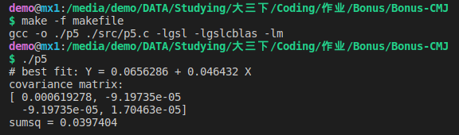
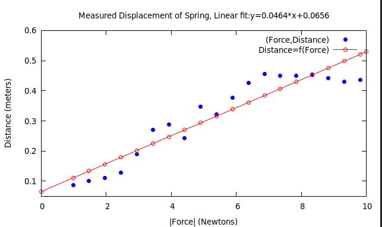
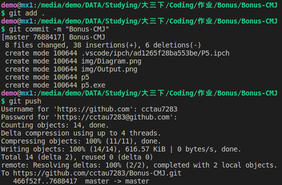

This work is mainly to do linear regression for a set of experimental data to find out whether the rule of Huke's Law is right. The data are stored in a csv file called sprinData.csv.  

## Part 1 Realising the function using C and gnuplot  
### Step 1 Reading Data from csv  
Open the file with fopen function, read the data(char type) line by line and put them into a string, which is then converted into double type and stored in an array.  
Using **gsl_fit_linear()** function, the linear regression is calculated. The covariance matrix can also be calculated and shown in the terminal.  

### Step 2 Plotting using GNUPLOT  
Using pipe to draw diagrams. After the necessary settings, the scatter plot and the line (with the regression point) are printed on the same diagram. It is clear how the data are arranged.  

### Step 3 Using makefile to compile  
The result on the terminal can be seen below.  
  
And the diagram looks like this.  
  

## Part 2 Putting it on GitHub  
For a start, it is needed to initiate and log in. (The screen is unfortunately lost, so only the screenshot of reloading could be taken.)  
Push the repository after README is finished. Note that I need to repeat this process after screenshoting this.  
  